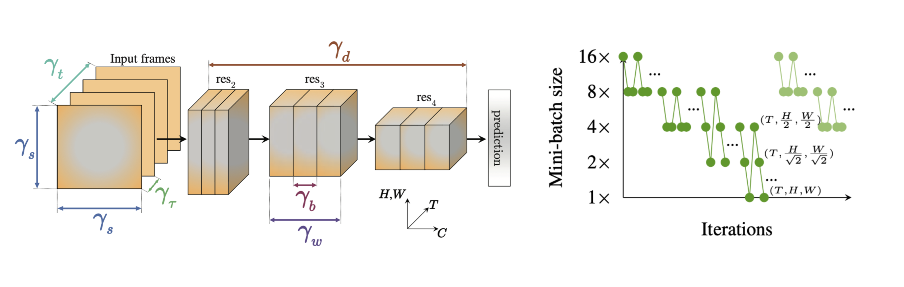

# PyTorch Implementation of X3D with Multigrid Training

This repository contains a PyTorch implementation for "X3D: Expanding Architectures for Efficient Video Recognition models" [[CVPR2020]](http://openaccess.thecvf.com/content_CVPR_2020/papers/Feichtenhofer_X3D_Expanding_Architectures_for_Efficient_Video_Recognition_CVPR_2020_paper.pdf) with "A Multigrid Method for Efficiently Training Video Models" [[CVPR2020]](http://openaccess.thecvf.com/content_CVPR_2020/papers/Wu_A_Multigrid_Method_for_Efficiently_Training_Video_Models_CVPR_2020_paper.pdf). In contrast to the original repository [(here)](https://github.com/facebookresearch/SlowFast) by FAIR, this repository provides a simpler, less modular and more familiar structure of implementation for faster and easier adoptation. 

### Introduction



X3D is an efficient video architecture, searched/optimized for learning video representations. Here, the author expands a tiny base network along axes: space and time (of the input), width and depth (of the network), optimizing for the performace at a given complexity (params/FLOPs). It further relies on depthwise-separable 3D convolutions [[1]](https://arxiv.org/pdf/1704.04861.pdf), inverted-bottlenecks in residual blocks [[2]](https://openaccess.thecvf.com/content_cvpr_2018/papers/Sandler_MobileNetV2_Inverted_Residuals_CVPR_2018_paper.pdf), squeeze-and-excitation blocks [[3]](https://openaccess.thecvf.com/content_cvpr_2018/papers/Hu_Squeeze-and-Excitation_Networks_CVPR_2018_paper.pdf), swish (soft) activations [[4]](https://arxiv.org/pdf/1710.05941;%20http://arxiv.org/abs/1710.05941.pdf) and sparse clip sampling (at inference) to improve its efficiency.

Multigrid training is a mechanism to train video architectures efficiently. Instead of using a fixed batch size for training, this method proposes to use varying batch sizes in a defined schedule, yet keeping the computational budget approximately unchaged by keeping `batch x time x height x width` a constant. Hence, this follows a coarse-to-fine training process by having lower spatio-temporal resolutions at higher batch sizes and vice-versa. In contrast to conventioanl training with a fixed batch size, Multigrid training benefit from 'seeing' more inputs during a training schedule at approximately the same computaional budget.

Our implementaion achieves 62.62% Top-1 accuracy (3-view) on Kinetics-400 when trained for ~200k iterations from scratch (a 4x shorter schedule compared to the original, when adjusted with the linear scaling rule [[5]](https://arxiv.org/pdf/1706.02677.pdf%5B3%5D%20ImageNet)), which takes only ~2.8 days on 4 Titan RTX GPUs. This is much faster than previous Kinetics-400 training schedules on a single machine. Longer schedules can achieve SOTA results. We port and include the weights trained by FAIR for a longer schedule on 128 GPUs, which achieves 71.48% Top-1 accuracy (3-view) on Kinetics-400. This can be used for fine-tuning on other datasets. For instance, we can train on Charades classification (35.01% mAP) and localization (17.71% mAP) within a few hours on 2 Titan RTX GPUs. All models and training logs are included in the repository. 

Note: the Kinetics-400 dataset that we trained on contains ~220k (~240k) training and ~17k (~20k) validation clips compared to (original dataset) due to availability. 


### Tips and Tricks

- 3D depthwise-separable convolutions are slow in current PyTorch releases as identified by FAIR. Make sure to build from source with [this fix](https://github.com/pytorch/pytorch/pull/40801). Only a few files are changed, this can be manually edited easily in the version of the source you use. In our setting, this fix reduced the training time from ~4 days to ~2.8 days.

- In my experience, dataloading and preprocessing speeds are as follows: accimage ≈ Pillow-SIMD >> Pillow > OpenCV. This is not formally verified by me, but check [here](https://python-pillow.org/pillow-perf) for some benchmarks.

- Use the linear scaling rule [[5]](https://arxiv.org/pdf/1706.02677.pdf%5B3%5D%20ImageNet) to adjust the learning rate and training schedule when using a different base batch size.

- For longer schedules, enable random spatial scaling, and use the original temporal stride (we use 2x stride in the shorter schedule).

### Dependencies

- Python 3.7.6
- PyTorch 1.7.0 (built from source, with [this fix](https://github.com/pytorch/pytorch/pull/40801)). This issue is fixed in PyTorch >= 1.9 releases.
- torchvision 0.8.0 (built from source)
- accimage 0.1.1
- pkbar 0.5

### Quick Start

Edit the Dataset directories to fit yours, adjust the learning rate and the schedule, and,

- Use `python train_x3d_kinetics_multigrid.py -gpu 0,1,2,3` for training on Kinetics-400.
- Use `python train_x3d_charades.py -gpu 0,1` for training on Charades classification.
- Use `python train_x3d_charades_loc.py -gpu 0,1` for training on Charades localization.

Charades dataset can be found [here](http://vuchallenge.org/charades.html). Kinetics-400 data is only partially available on YouTube now. Use annotations [here](https://github.com/Showmax/kinetics-downloader). I would recommend [this](https://github.com/Showmax/kinetics-downloader) repo for downloading Kinetics data. If you want access to our Kinetics-400 data (~220k training and ~17k validation), please drop me an email.

### Reference

If you find this work useful, please consider citing the original authors:
```
@inproceedings{feichtenhofer2020x3d,
  title={X3D: Expanding Architectures for Efficient Video Recognition},
  author={Feichtenhofer, Christoph},
  booktitle={Proceedings of the IEEE/CVF Conference on Computer Vision and Pattern Recognition},
  pages={203--213},
  year={2020}
}

@inproceedings{wu2020multigrid,
  title={A Multigrid Method for Efficiently Training Video Models},
  author={Wu, Chao-Yuan and Girshick, Ross and He, Kaiming and Feichtenhofer, Christoph and Krahenbuhl, Philipp},
  booktitle={Proceedings of the IEEE/CVF Conference on Computer Vision and Pattern Recognition},
  pages={153--162},
  year={2020}
}
```

### Acknowledgements

I would like to thank the original authors for their work. Also, I thank AJ Piergiovanni for sharing his Multigrid implementation.

